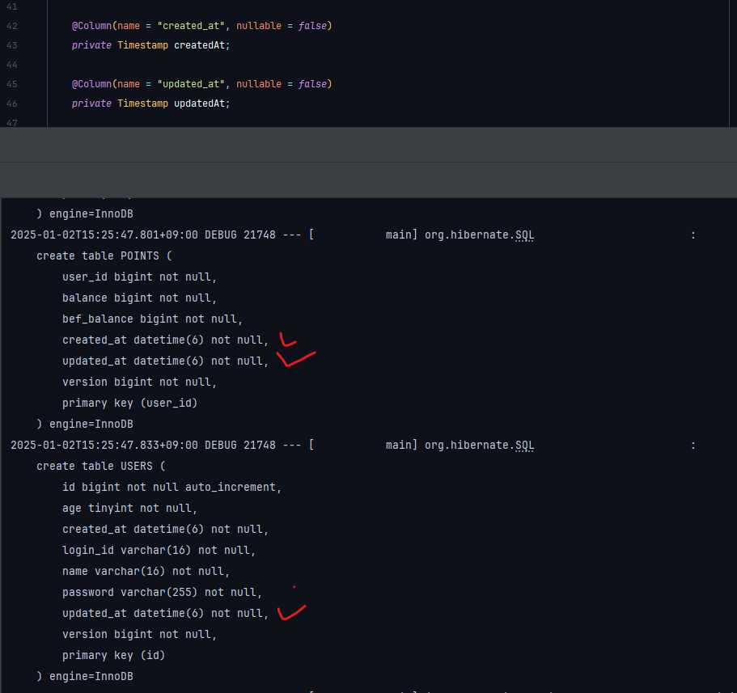

# 멘토링

## 1. 로컬 개발환경 구성

```sql
CREATE SCHEMA `mentoring` DEFAULT CHARACTER SET utf8mb4 ;
CREATE SCHEMA `mentoring_junit` DEFAULT CHARACTER SET utf8mb4 ;

GRANT ALL privileges on `mentoring`.* to 'hello'@'%';
GRANT ALL privileges on `mentoring_junit`.* to 'hello'@'%';
```

## 2. Date 관련 필드는 반드시 `Timestamp`로 컬럼 지정

